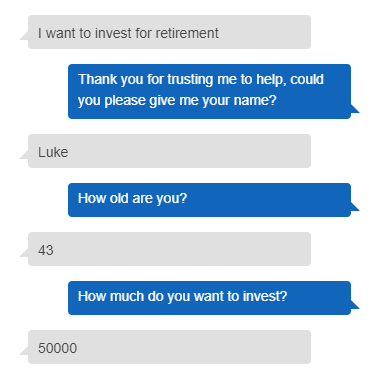
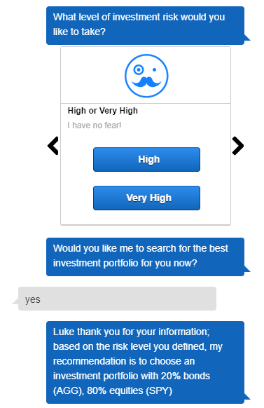

# unit13_challenge_RoboAdvisor

## Background

This repository showcases an Amazon Lex robo advisor bot that suggests an investment portfolio for retirement. 

### Tasks completed

1. Initial robo advisor configuration

2. Build and test the robo advisor

3. Enhance the robo advisor with an amazon lambda function

### Built with 

* AWS

* Python

* Jupyter notebook

- - - 