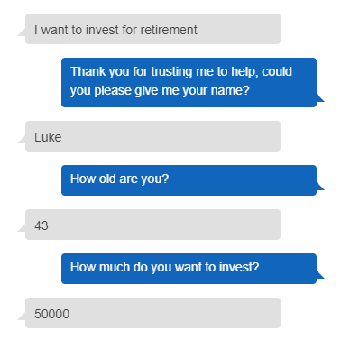
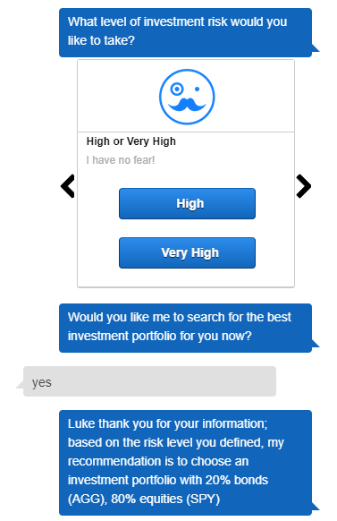

# unit13_challenge_RoboAdvisor

## Background

This repository showcases an Amazon Lex Robo Advisor bot that suggests an investment portfolio for retirement. 

### Tasks completed:

1. Initial Robo Advisor Configuration

2. Build and Test the Robo Advisor

3. Enhance the Robo Advisor with an Amazon Lambda Function

### Built with 

* Amazon Web Services

* python

* jupyter notebook

- - - 